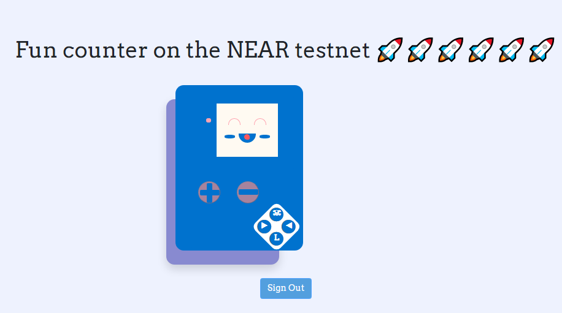
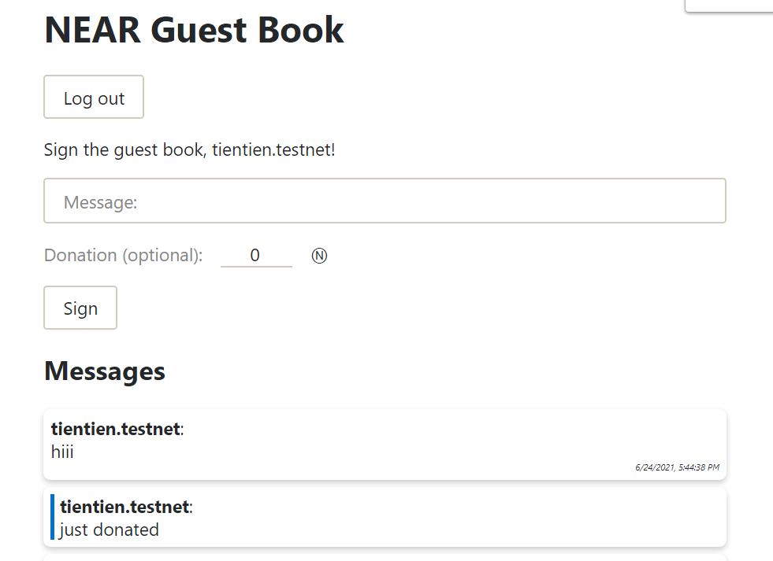

__here is what I did__

+ Counter:
  - Change styles and text, set step counter to 5 instead of 1 
  - Build and deploy to the NEAR testnet, txid: EWa9X8HJGgNtAJNXnGz2CE5mncCF21wyGyzcSfiTNCwj

  

+ Guest book:
  - Add card style for message
  - Message will show immediatily after press Sign instead of wait for data submit to NEAR
  - Add message datetime 
  - Build and deploy to NEAR testnet, txid: CB3AYpPTwZbjMg2jWVfvkVpz7Yaatszj8MPJbDeUoZ5U

